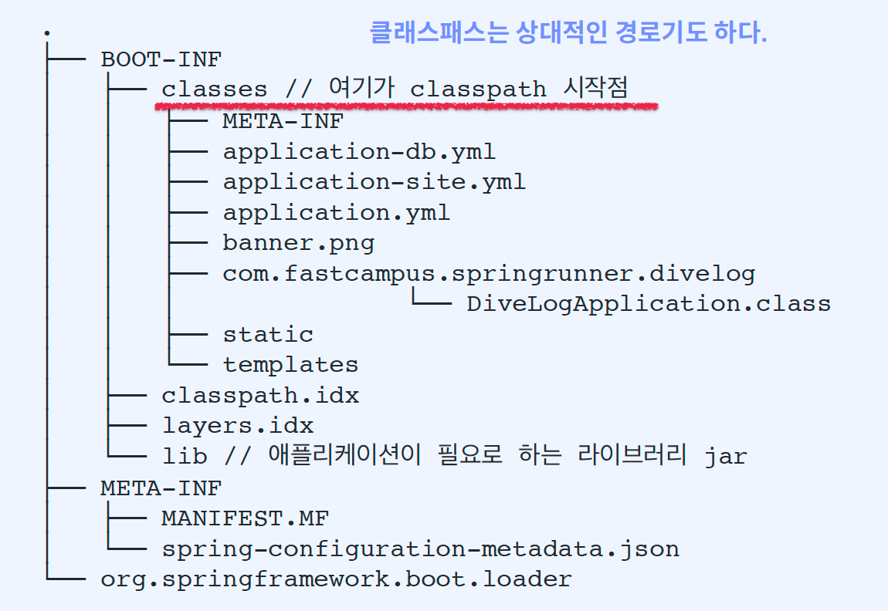
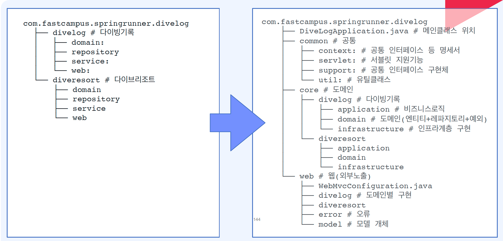

# Div Log

## 02. SpringApplication 살펴보기
Console에서 Argument 전달 방법

```bash
./gradlew bootRun --args="--app.name=dive-log-cmd"
```

Console에서 build 하는 방법

```bash
./gradlew clean build
```

빌드시 두개의 jar가 생성되는데 plain jar파일은 일반 적인 배포형태의 jar 파일임

실행가능한 jar 생성

```bash
unzip dive-log-0.0.1-SNAPSHOT.jar -d executable-jar
```

jar파일 실행

```bash
java -jar dive-log-0.0.1-SNAPSHOT.jar --app.name=dive-log-jar
```

## 03. 애플리케이션 구성파일 살펴보기

application.yml 무작위값 주입

```yaml
my:
  secret: "${random.value}" ## 무작위로 생성된 문자열
  number: "${random.int}" ## 무작위 Integer 타입값 주입
  bignumber: "${random.long}" ## 무작위 Long 타입값 주입
  uuid: "${random.uuid}" ## UUID 값 생성
  number-less-than-ten: "${random.int(10)}" ## 10보다 작은 수
  number-in-range: "${random.int[1024,65536]}" ## 1024 와 65536 사이 숫자 무작위
```

배열 표현 방식

properties

```properties
my.servers[0]=dev.example.com
my.servers[1]=another.example.com
```

yaml

```yaml
my:
  servers:
    - "dev.example.com"
    - "another.example.com"
```

타입 세이프한 구성속성 사용방법

```yaml
my.service:
  enabled: true
  remote-address: 192.168.0.1
  security:
    username: Honeymon
    password: password1234
    roles:
      - USER
      - MANAGER
  attrs:
    hasWriteAuthority: false
    hasReadAuthority: true
    hasDeleteAuthority: false
```

application.yml 구성속성 값과 일치하는 값을 맵핑함

```java
@Getter
@Setter
@ToString
@ConfigurationProperties("my.service")
public class MyServiceProperties {
    private boolean enabled;
    private InetAddress remoteAddress;
    private final Security security = new Security();
    
    @Getter
    @Setter
    @ToString
    public static class Security {
        private String username;
        private String password;
        private List<String> roles;
        private Map<String, Boolean> attrs;
    }
}
```

두가지 방식으로 MyServiceProperties Configuration을 활성화 할 수 있음

- `@ConfigurationPropertiesScan`
- `@EnableConfigurationProperties({MyServiceProperties.class})`

```java
@Configuration
@ConfigurationPropertiesScan
// @EnableConfigurationProperties({MyServiceProperties.class})
public class AppConfiguration {
}
```

## 04. 애플리케이션 구성파일 작성하기
### 스프링 부트 2.4 이전

하나의 파일에서 다양한 profiles를 구분짓고 정의를 할 수 있었음

```yaml
spring.profiles: "prod"
```

2.4 이전에는 profiles와 include를 각각 정의 했었는데

```properties
spring.profiles: "debug"
spring.profiles.include: "debugdb,debugcloud"
```

### 스프링 부트 2.4 이후

특정 profile이 활성화 됐을 때 적용되는 형식으로 변경됨

```yaml
spring.config.activate.on-profile: "prod"
```

2.4 이후에는 profiles를 group으로 묶고 include를 그룹으로 정의함

```yaml
spring:
  profiles:
    group:
      "debug": "debugdb,debugcloud"
```

`spring.profiles.include`는 사용가능하지만, 프로파일이 선언된 문서에서는 함께 사용할 수 없다

```yaml
spring:
  config:
    activate:
      on-profile: "debug"
  profiles:
    include: "debugdb,debugcloud"
```

### `application-db.yml` 작성

```yaml
spring:
  jpa:
    show-sql: false
    open-in-view: false
    database-platform: MYSQL
    hibernate:
      ddl-auto: none
      use-new-id-generator-mappings: false
    properties:
      hibernate.format_sql: true
      hibernate.show_sql: false
      hibernate.dialect: org.hibernate.dialect.MySQL57Dialect
      hibernate.default_fetch_size: ${chunkSize:100}
      hibernate.connection.provider_disables_autocommit: true
      hibernate.jdbc.batch_size: ${chunkSize:100}
      hibernate.order_inserts: true
      hibernate.order_updates: true

---
spring:
  config:
    activate:
      on-profile: "db-local"

  jpa:
    show-sql: true
    database-platform: H2
    hibernate:
      ddl-auto: update

  datasource:
    hikari:
      driver-class-name: org.h2.Driver
      jdbc-url: jdbc:h2:mem:divelog;MODE=MySQL;DATABASE_TO_LOWER=true;DB_CLOSE_DELAY=-1;DB_CLOSE_ON_EXIT=FALSE;
      username: sa
      password:
---
spring:
  config:
    activate:
      on-profile: "db-dev"

  jpa:
    hibernate:
      ddl-auto: none
  datasource:
    hikari:
      driver-class-name: org.mariadb.jdbc.Driver
      jdbc-url: jdbc:mysql:aurora://...:3306/divelog
      username: svc_divelog
      password: 1234 #TODO Generated
      maxLifetime: 58000 # 58sec(서버 연결시간보다 짧게, 커넥션풀 타임아웃 3초)
      connectionTimeout: 3000 # 3sec
      maximumPoolSize: 10
      data-source-properties: #https://2ssue.github.io/programming/HikariCP-MySQL/
        useServerPrepStmts: false
        rewriteBatchedStatements: true
        connectionTimeout: 3000
        socketTimeout: 60000
        useSSL: false
```

### `application.yml`에 db 적용

```yaml
spring:
  profiles:
    active:
      - local
    include:
      - db
  banner.image:
    bitdepth: 8
    width: 100
my.service:
  enabled: true
  remote-address: 192.168.0.1
  security:
    username: Honeymon
    password: password1234
    roles:
      - USER
      - MANAGER
    attrs:
      hasWriteAuthority: false
      hasReadAuthority: true
      hasDeleteAuthority: false
```

### `@ConfigurationProperties` 클래스 작성

```yaml
site:
  author-name: Honeymon
  author-email: ihoneymon@gmail.com

---
spring:
  config:
    activate:
      on-profile: "site-local"

site:
  author-name: Honeymon-local
  author-email: ihoneymon.local@gmail.com

---
spring:
  config:
    activate:
      on-profile: "site-dev"

site:
  author-name: Honeymon-dev
  author-email: ihoneymon.dev@gmail.com
```

### SiteProperties.java 작성

```java

@Getter
@ToString
@ConfigurationProperties(prefix = "site")
public class SiteProperties {
    private final String authorName;
    private final String authorEmail;

    @ConstructorBinding
    public SiteProperties(String authorName, String authorEmail) {
        this.authorName = authorName;
        this.authorEmail = authorEmail;
    }

}
```

### `@EnableConfigurationProperties` 사용

- `AppConfiguration.java`

```java

@Configuration
@EnableConfigurationProperties({ SiteProperties.class })
public class AppConfiguration {
}
```

- `SitePropertiesTest.java`

```java

@SpringBootTest
class SitePropertiesTest {

    @Test
    void test(@Autowired SiteProperties siteProperties) {
        assertThat(siteProperties.getAuthorName()).isEqualTo("Honeymon-local");
        assertThat(siteProperties.getAuthorEmail()).isEqualTo("ihoneymon.local@gmail.com");
    }

}
```

- `SitePropertiesDevTest.java`

```java

@ActiveProfiles("dev")
@SpringBootTest
class SitePropertiesDevTest {

    @Test
    void test(@Autowired SiteProperties siteProperties) {
        assertThat(siteProperties.getAuthorName()).isEqualTo("Honeymon-dev");
        assertThat(siteProperties.getAuthorEmail()).isEqualTo("ihoneymon.dev@gmail.com");
    }

}
```

## 05. 스프링 부트에 적합한 코드 구조 이해하기

커맨드로 build

```bash
$ ./gradlew clean build
```

- plain.jar 구조


- excutable.jar by 스프링 부트



- 프로젝트 패키지 구조



## 07. 스프링 부트 스타터 살펴보기

Gradle 7 버전대부터 사용가능한 모듈 대체 기능 사용  
아래와 같이 설정하면 SpringBoot 기본 Tomcat 모듈을 Jetty로 대체되도록 설정할 수 있음

```groovy
dependencies {
    modules {
        module('org.springframework.boot:spring-boot-starter-tomcat') {
            replacedBy('org.springframework.boot:spring-boot-starter-jetty', '모듈대체기능확인')
        }
    }   
}
```

## 08. 스프링 프로그래밍 모델이랑 무엇인가
- 스프링 3개 핵심기술
  - 의존 관계 주입(Dependency Injection)
  - 관점 지향 프로그래밍(Aspect Oriented Programming)
  - 이식 가능한 서비스 추상화(Portable Service Abstraction)

순수 객쳬(POJO): 스프링의 3대 주요 기술이 POJO 프로그래밍 지원  
스프링 프로그래밍 모델(Spring Programming Model) = 스프링이 제공하는 3가지 기술(DI/IoC, PSA, AOP)을 이용한 프로그래밍 모델

## 09. 스프링 애너테이션 프로그래밍 모델이란 무엇인가
- 애노테이션 정의
  - 메타 애노테이션(Meta-Annotation)
  - 스테레오타입 애노테이션(Stereotype Annotation)
  - 컴포지드 애노테이션(Composed Annotation)

'역할'과 '행위'를 정의하는데 활용  
AOP에서 사용하는 이상적인 개입지점

## 10. 스프링 빈과 의존성 주입
- 의존성 주입(Dependency Injection): 자동와이어링(`@Autowired`)
  - 필드 의존성 주입: 권장하지 않음 생성자 의존성 주입 방식을 권장 
  - 설정자(Setter) 의존성 주입
  - 생성자 의존성 주입: 생성자가 1개만 존재한다면 `@Autowired` 생략가능 (Spring 4.3 버전부터 지원)
    - 의존성이 주입된 후 불변성을 가진다
    - 코드가 안전해진다
    - 코드 설계 시 고민을 강요한다
      - 생성자 인자가 늘어나면 뭔가 이상함을 느끼기 시작한다
    - 테스트 하기 좋다