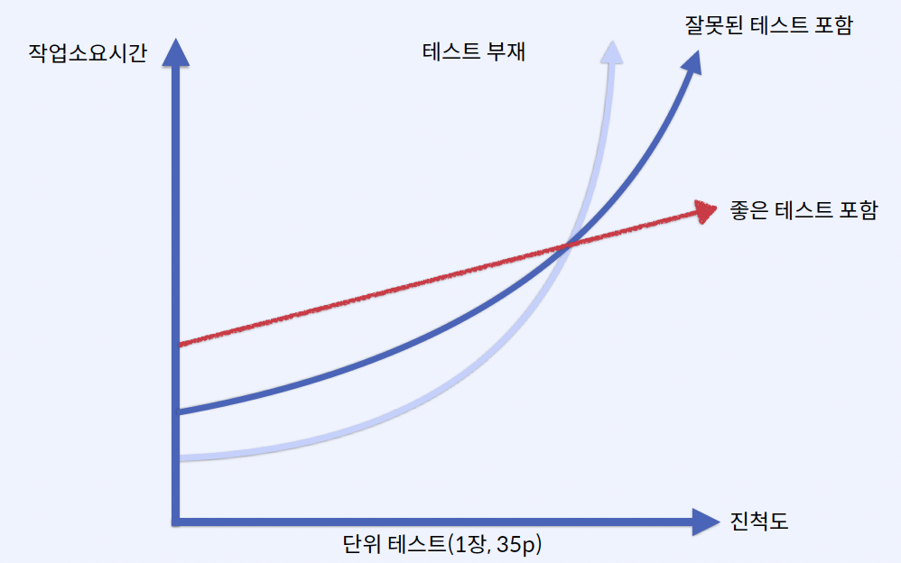

# Div Log

## 02. SpringApplication 살펴보기
Console에서 Argument 전달 방법

```bash
./gradlew bootRun --args="--app.name=dive-log-cmd"
```

Console에서 build 하는 방법

```bash
./gradlew clean build
```

빌드시 두개의 jar가 생성되는데 plain jar파일은 일반 적인 배포형태의 jar 파일임

실행가능한 jar 생성

```bash
unzip dive-log-0.0.1-SNAPSHOT.jar -d executable-jar
```

jar파일 실행

```bash
java -jar dive-log-0.0.1-SNAPSHOT.jar --app.name=dive-log-jar
```

## 03. 애플리케이션 구성파일 살펴보기

application.yml 무작위값 주입

```yaml
my:
  secret: "${random.value}" ## 무작위로 생성된 문자열
  number: "${random.int}" ## 무작위 Integer 타입값 주입
  bignumber: "${random.long}" ## 무작위 Long 타입값 주입
  uuid: "${random.uuid}" ## UUID 값 생성
  number-less-than-ten: "${random.int(10)}" ## 10보다 작은 수
  number-in-range: "${random.int[1024,65536]}" ## 1024 와 65536 사이 숫자 무작위
```

배열 표현 방식

properties

```properties
my.servers[0]=dev.example.com
my.servers[1]=another.example.com
```

yaml

```yaml
my:
  servers:
    - "dev.example.com"
    - "another.example.com"
```

타입 세이프한 구성속성 사용방법

```yaml
my.service:
  enabled: true
  remote-address: 192.168.0.1
  security:
    username: Honeymon
    password: password1234
    roles:
      - USER
      - MANAGER
  attrs:
    hasWriteAuthority: false
    hasReadAuthority: true
    hasDeleteAuthority: false
```

application.yml 구성속성 값과 일치하는 값을 맵핑함

```java
@Getter
@Setter
@ToString
@ConfigurationProperties("my.service")
public class MyServiceProperties {
    private boolean enabled;
    private InetAddress remoteAddress;
    private final Security security = new Security();

    @Getter
    @Setter
    @ToString
    public static class Security {
        private String username;
        private String password;
        private List<String> roles;
        private Map<String, Boolean> attrs;
    }
}
```

두가지 방식으로 MyServiceProperties Configuration을 활성화 할 수 있음

- `@ConfigurationPropertiesScan`
- `@EnableConfigurationProperties({MyServiceProperties.class})`

```java
@Configuration
@ConfigurationPropertiesScan
// @EnableConfigurationProperties({MyServiceProperties.class})
public class AppConfiguration {
}
```

## 04. 애플리케이션 구성파일 작성하기
### 스프링 부트 2.4 이전

하나의 파일에서 다양한 profiles를 구분짓고 정의를 할 수 있었음

```yaml
spring.profiles: "prod"
```

2.4 이전에는 profiles와 include를 각각 정의 했었는데

```properties
spring.profiles: "debug"
spring.profiles.include: "debugdb,debugcloud"
```

### 스프링 부트 2.4 이후

특정 profile이 활성화 됐을 때 적용되는 형식으로 변경됨

```yaml
spring.config.activate.on-profile: "prod"
```

2.4 이후에는 profiles를 group으로 묶고 include를 그룹으로 정의함

```yaml
spring:
  profiles:
    group:
      "debug": "debugdb,debugcloud"
```

`spring.profiles.include`는 사용가능하지만, 프로파일이 선언된 문서에서는 함께 사용할 수 없다

```yaml
spring:
  config:
    activate:
      on-profile: "debug"
  profiles:
    include: "debugdb,debugcloud"
```

### `application-db.yml` 작성

```yaml
spring:
  jpa:
    show-sql: false
    open-in-view: false
    database-platform: MYSQL
    hibernate:
      ddl-auto: none
      use-new-id-generator-mappings: false
    properties:
      hibernate.format_sql: true
      hibernate.show_sql: false
      hibernate.dialect: org.hibernate.dialect.MySQL57Dialect
      hibernate.default_fetch_size: ${chunkSize:100}
      hibernate.connection.provider_disables_autocommit: true
      hibernate.jdbc.batch_size: ${chunkSize:100}
      hibernate.order_inserts: true
      hibernate.order_updates: true

---
spring:
  config:
    activate:
      on-profile: "db-local"

  jpa:
    show-sql: true
    database-platform: H2
    hibernate:
      ddl-auto: update

  datasource:
    hikari:
      driver-class-name: org.h2.Driver
      jdbc-url: jdbc:h2:mem:divelog;MODE=MySQL;DATABASE_TO_LOWER=true;DB_CLOSE_DELAY=-1;DB_CLOSE_ON_EXIT=FALSE;
      username: sa
      password:
---
spring:
  config:
    activate:
      on-profile: "db-dev"

  jpa:
    hibernate:
      ddl-auto: none
  datasource:
    hikari:
      driver-class-name: org.mariadb.jdbc.Driver
      jdbc-url: jdbc:mysql:aurora://...:3306/divelog
      username: svc_divelog
      password: 1234 #TODO Generated
      maxLifetime: 58000 # 58sec(서버 연결시간보다 짧게, 커넥션풀 타임아웃 3초)
      connectionTimeout: 3000 # 3sec
      maximumPoolSize: 10
      data-source-properties: #https://2ssue.github.io/programming/HikariCP-MySQL/
        useServerPrepStmts: false
        rewriteBatchedStatements: true
        connectionTimeout: 3000
        socketTimeout: 60000
        useSSL: false
```

### `application.yml`에 db 적용

```yaml
spring:
  profiles:
    active:
      - local
    include:
      - db
  banner.image:
    bitdepth: 8
    width: 100
my.service:
  enabled: true
  remote-address: 192.168.0.1
  security:
    username: Honeymon
    password: password1234
    roles:
      - USER
      - MANAGER
    attrs:
      hasWriteAuthority: false
      hasReadAuthority: true
      hasDeleteAuthority: false
```

### `@ConfigurationProperties` 클래스 작성

```yaml
site:
  author-name: Honeymon
  author-email: ihoneymon@gmail.com

---
spring:
  config:
    activate:
      on-profile: "site-local"

site:
  author-name: Honeymon-local
  author-email: ihoneymon.local@gmail.com

---
spring:
  config:
    activate:
      on-profile: "site-dev"

site:
  author-name: Honeymon-dev
  author-email: ihoneymon.dev@gmail.com
```

### SiteProperties.java 작성

```java

@Getter
@ToString
@ConfigurationProperties(prefix = "site")
public class SiteProperties {
    private final String authorName;
    private final String authorEmail;

    @ConstructorBinding
    public SiteProperties(String authorName, String authorEmail) {
        this.authorName = authorName;
        this.authorEmail = authorEmail;
    }

}
```

### `@EnableConfigurationProperties` 사용

- `AppConfiguration.java`

```java

@Configuration
@EnableConfigurationProperties({ SiteProperties.class })
public class AppConfiguration {
}
```

- `SitePropertiesTest.java`

```java

@SpringBootTest
class SitePropertiesTest {

    @Test
    void test(@Autowired SiteProperties siteProperties) {
        assertThat(siteProperties.getAuthorName()).isEqualTo("Honeymon-local");
        assertThat(siteProperties.getAuthorEmail()).isEqualTo("ihoneymon.local@gmail.com");
    }

}
```

- `SitePropertiesDevTest.java`

```java

@ActiveProfiles("dev")
@SpringBootTest
class SitePropertiesDevTest {

    @Test
    void test(@Autowired SiteProperties siteProperties) {
        assertThat(siteProperties.getAuthorName()).isEqualTo("Honeymon-dev");
        assertThat(siteProperties.getAuthorEmail()).isEqualTo("ihoneymon.dev@gmail.com");
    }

}
```

## 05. 스프링 부트에 적합한 코드 구조 이해하기

커맨드로 build

```bash
$ ./gradlew clean build
```

- plain.jar 구조


- excutable.jar by 스프링 부트


- 프로젝트 패키지 구조


## 07. 스프링 부트 스타터 살펴보기

Gradle 7 버전대부터 사용가능한 모듈 대체 기능 사용  
아래와 같이 설정하면 SpringBoot 기본 Tomcat 모듈을 Jetty로 대체되도록 설정할 수 있음

```groovy
dependencies {
    modules {
        module('org.springframework.boot:spring-boot-starter-tomcat') {
            replacedBy('org.springframework.boot:spring-boot-starter-jetty', '모듈대체기능확인')
        }
    }
}
```

## 08. 스프링 프로그래밍 모델이랑 무엇인가
- 스프링 3개 핵심기술
    - 의존 관계 주입(Dependency Injection)
    - 관점 지향 프로그래밍(Aspect Oriented Programming)
    - 이식 가능한 서비스 추상화(Portable Service Abstraction)

순수 객쳬(POJO): 스프링의 3대 주요 기술이 POJO 프로그래밍 지원  
스프링 프로그래밍 모델(Spring Programming Model) = 스프링이 제공하는 3가지 기술(DI/IoC, PSA, AOP)을 이용한 프로그래밍 모델

## 09. 스프링 애너테이션 프로그래밍 모델이란 무엇인가
- 애노테이션 정의
    - 메타 애노테이션(Meta-Annotation)
    - 스테레오타입 애노테이션(Stereotype Annotation)
    - 컴포지드 애노테이션(Composed Annotation)

'역할'과 '행위'를 정의하는데 활용  
AOP에서 사용하는 이상적인 개입지점

## 10. 스프링 빈과 의존성 주입
- 의존성 주입(Dependency Injection): 자동와이어링(`@Autowired`)
    - 필드 의존성 주입: 권장하지 않음 생성자 의존성 주입 방식을 권장
    - 설정자(Setter) 의존성 주입
    - 생성자 의존성 주입: 생성자가 1개만 존재한다면 `@Autowired` 생략가능 (Spring 4.3 버전부터 지원)
        - 의존성이 주입된 후 불변성을 가진다
        - 코드가 안전해진다
        - 코드 설계 시 고민을 강요한다
            - 생성자 인자가 늘어나면 뭔가 이상함을 느끼기 시작한다
        - 테스트 하기 좋다

## 11. DiveLog 코드 작성하기
- Swagger Hub에 작성된 API Documents
    - https://app.swaggerhub.com/apis-docs/ihoneymon/dive-log/1.0.0
- dive-log 프로젝트 예제
    - https://github.com/springrunner/fastcampus-class-201/tree/main/dive-log
- 테이블 기본키(PK, Primary Key) 선정방식
    - 자연키: 전화번호, 이메일, 주민번호, 회원번호
        - 자연키를 기본키로 채택하는 것은 추천하지 않음
        - 개인정보보호법 영향을 받는다(https://www.privacy.go.kr/nns/ntc/inf/personalInfo.do)
        - 변경될 수 있다
    - 대체키: 비즈니스와 상관없는 임의 생성 키
- DiveResort 구현하기
- DiveResort 엔티티

### 엔티티 기본키(PK) 자동생성전략

| 전략       | 설명                                                                                             |
|:---------|------------------------------------------------------------------------------------------------|
| IDENTITY | 키 생성을 데이터베이스에 위임<br/>(ID값을 null로 전달하면 DB에서 자동증가된 값을 제공)                                        |
| SEQUENCE | 데이터베이스 Squence 개체를 사용하여 자동생성된 숫자를 활용한다                                                         |
| TABLE    | 키 생성 전용 테이블을 만들어 데이터베이스 시퀀스 개체를 흉내내는 전략                                                        |
| AUTO     | 방언(Dialect)에서 적절한 방식을 선택해서 사용<br/>*스프링 부트 2.0 부터 사용한 Hibernate 5.0 부터 IDENTITY에서 TABLE 방식으로 변경 |

### 기본 키 생성전략 IDENTITY 사용

```java
@Id
@GeneratedValue(strategy = GenerationType.IDENTITY)
private Long id;
```

하이버 네이트 새로운 ID 생성전략 비활성화

```properties
spring.jpa.hibernate.use-new-id-generator-mappings: false
```

### `@Transactional(readOnly)`를 이용한 Reader/Writer 라우팅

https://vladmihalcea.com/read-write-read-only-transaction-routing-spring/

```java
@Service
public class DiveResortManager implements DiveResortEditor, DiveResortFinder {
    //코드 생략  
    @Transactional(readOnly = true)
    @Override
    public List<DiveResortDto> findAll() {
        return repository.findAll().stream()
                .map(DiveResortDto::ofEntity)
                .collect(Collectors.toList());
    }

    @Transactional(readOnly = true)
    @Override
    public Optional<DiveResortDto> findByDiveResortId(Long diveResortId) {
        return repository.findById(diveResortId).map(DiveResortDto::ofEntity);
    }
    //코드생략
}
```

### Bean validation 추가

https://github.com/spring-projects/spring-boot/wiki/Spring-Boot-2.3-Release-Notes#validation-starter-no-longer-included-in-web-starters

스프링 부트 2.3부터 애플리케이션에서 검증(validation)을 이용하려면
spring-boot-starter-validation 스타터를 추가해야 한다

- Bean validation 의존성 추가

```xml
<dependency>
    <groupId>org.springframework.boot</groupId>
    <artifactId>spring-boot-starter-validation</artifactId>
</dependency>
```

```groovy
dependencies {
    ...
    implementation 'org.springframework.boot:spring-boot-starter-validation'
}
```

```java
@Getter
public class DiveResortRegisterRequest {
    @NotEmpty
    private String name;
    @NotEmpty
    private String ownerName;
    @NotEmpty
    private String contactNumber;
    @NotEmpty
    private String address;
    @NotEmpty
    private String description;

    public DiveResortRegisterCommand convertToRegisterCommand() {
        return DiveResortRegisterCommand.create(getName(), getOwnerName(), getContactNumber(), getAddress(),
                getDescription());
    }
}
```

## 12. DiveLog 코드 테스트하기

- Spring-boot-starter-test
- 테스트 슬라이스(Test Slice)
- 테스트를 통해 DiveLog 기능 구현
- 테스트로 DiveLog 구현하기
- DiveLog 생성메서드 테스트 케이스 작성
- DiveLog 생성메서드 테스트 수행 확인
- DiveLogRepository 테스트
- DiveLogManager 테스트하기
- DiveLogRestController 구현 및 테스트

### 테스트 지원 모듈

https://docs.spring.io/spring-boot/docs/current/reference/htmlsingle/#features.testing

- 애플리케이션 테스트 지원 모듈
    - spring-boot-test
    - spring-boot-test-autoconfigure

### spring-boot-starter-test 스타터

- JUnit 5
- Spring Test & Spring Boot Test
- AssertJ
- Hamcrest
- Mockito
- JSONassert
- JsonPath

### 테스트 슬라이스(Test Slice)

https://spring.io/blog/2016/08/30/custom-test-slice-with-spring-boot-1-4

```java
@RunWith(SpringRunner.class)
@WebMvcTest(UserVehicleController.class)
public class UserVehicleControllerTests {

    @Autowired
    private MockMvc mvc;

    @MockBean
    private UserVehicleService userVehicleService;

    @Test
    public void testExample() throws Exception {
        given(this.userVehicleService.getVehicleDetails("sboot"))
                .willReturn(new VehicleDetails("Honda", "Civic"));
        this.mvc.perform(get("/sboot/vehicle").accept(MediaType.TEXT_PLAIN))
                .andExpect(status().isOk()).andExpect(content().string("Honda Civic"));
    }

}
```

### 테스트 자동구성 애노테이션(spring-boot-test-autoconfigure)

https://docs.spring.io/spring-boot/docs/current/reference/htmlsingle/#appendix.test-auto-configuration

- `@DataCassandraTest`
- `@DataCouchbaseTest`
- `@DataElasticsearchTest`
- `@DataJdbcTest`
- `@DataJpaTest`
- `@DataLdapTest`
- `@DataMongoTest`
- `@DataNeo4jTest`
- `@DataR2dbcTest`
- `@DataRedisTest`
- `@GraphQlTest`
- `@JdbcTest`
- `@JooqTest`
- `@JsonTest`
- `@RestClientTest`
- `@WebFluxTest`
- `@WebMvcTest`
- `@WebServiceClientTest`
- `@WebServiceServerTest`

### 웹 애플리케이션 계층별 테스트 전략

| 구분         | 설명                                                                                                                                                                        |
|------------|---------------------------------------------------------------------------------------------------------------------------------------------------------------------------|
| Domain     | - 비즈니스로직 구현<br/>- 단위테스트(Unit test) 수행으로 충분함<br/>- 비즈니스 로직 및 객체변환 정도 테스트                                                                                                   |
| Repository | - 엔티티(Entity) 객체 사이 연관관계 구성 확인<br/>- Repository 정상 연동 확인<br/>- 통합테스트를 이용해서 Repository 계층 테스트 수행                                                                           |
| Service    | - 트랜잭션 관리를 주로 하는 계층<br/>- 서비스 계층에서 사용하는 Repository는 Repository 계층 테스트했으니 모킹(Mocking) 혹은 스텁(Stub) 객체로 대체- `@SpringBootTest`를 이용한 통합테스트 수행(트랜잭션 등 확인필요한 경우)                 |
| Controller | - 사용자 요청을 서비스 계층으로 전달하고 그 결과를 사용자에게 응답하는 모든 과정을 총괄<br/>- 스프링에서 수행하는 모든 부분을 테스트해야하기 때문에 통합테스트 수행<br/>- 요청이 서비스 계층까지 정상적으로 전달 및 처리 확인<br/>- `@SpringBootTest` 및 MockMvc를 이용 |


###  `@DataJpaTest` 사용시 - H2Database

http://www.h2database.com/javadoc/org/h2/engine/DbSettings.html#databaseToUpper

스프링 부트에서 사용하는 h2database.1.4.200 에서 DATABASE_TO_UPPER가 기본활성화되어 발생

```java
@DataJpaTest
// 애노테이션을 선언하여 테스트 데이터베이스 자동구성을 비활성화
@AutoConfigureTestDatabase(replace = Replace.NONE)
class DiveLogRepositoryTest {
    // 코드생략
}
```

### 정리
- spring-boot-starter-test 설명
- 단위테스트 작성
- 통합테스트 작성

## 13. 테스트에 대한 이야기
- 테스트를 해야하는 이유
- TDD, 단위테스트
- 통합테스트
- 테스트 코드를 통해 신뢰도를 높인다
- 테스트에 따른 진척도

### 참고도서
- 클린코드
- 단위테스트
- 자바와 JUnit을 활용한 실용주의 단위테스트

### `@ActiveProfiles`

클래스레벨에서 `@ActiveProfiles 애노테이션 활용해서 특정 프로파일을 활성화하여 조건 확인 가능

```java
@ActiveProfiles("dev")
@SpringBootTest
class SitePropertiesDevTest {

    @Test
    void test(@Autowired SiteProperties siteProperties) {
        assertThat(siteProperties.getAuthorName()).isEqualTo("Honeymon-dev");
        assertThat(siteProperties.getAuthorEmail()).isEqualTo("ihoneymon.dev@gmail.com");
    }

}
```

### 테스트에 따른 진척도



### 좋은 테스트? 잘못된 테스트?

- 백명석 클린코더스
    - https://www.youtube.com/playlist?list=PLagTY0ogyVkIl2kTr08w-4MLGYWJz7lNK
- 박재성 TDD 리팩토링
    - https://www.youtube.com/watch?v=bIeqAlmNRrA

### TDD 3단계


### 단위테스트 3가지 속성
- 작은 코드 조각(Unit, 단위)을 검증하고
- 빠르게 수행하고
- 다른 곳에 영향을 받지 않도록 격리하여 처리하는 **자동화 테스트**

### 단위 테스트 목표

소프트웨어 프로젝트의 지속 가능한 성장을 가능하게 하는 것

### DiveResortTest && Given - When - Then 패턴

```java
class DiveResortTest {
    @Test
    void testCreate() {
        String name = "동해다이브리조트";
        String ownerName = "허니몬";
        String contactNumber = "033-0000-0000";
        String address = "강원도 동해시 감추...";
        String description = "동해 어느구석";

        DiveResort diveResort = DiveResort.create(name, ownerName, contactNumber, address, description);

        SoftAssertions.assertSoftly(softly -> {
            softly.assertThat(diveResort.getName()).isEqualTo(name);
            softly.assertThat(diveResort.getOwnerName()).isEqualTo(ownerName);
            softly.assertThat(diveResort.getContactNumber()).isEqualTo(contactNumber);
            softly.assertThat(diveResort.getAddress()).isEqualTo(address);
            softly.assertThat(diveResort.getDescription()).isEqualTo(description);
            softly.assertThat(diveResort.getCreatedDateTime()).isNotNull();
            softly.assertThat(diveResort.getLastModifiedDateTime()).isNotNull();
            softly.assertThat(diveResort.getLastModifiedDateTime()).isEqualTo(diveResort.getCreatedDateTime());
        });
    }
}
```

### 테스트 도구
Groovy + Spock

### 계층별 테스트
### 테스트 컨텍스트 파편화

```java
@DataJpaTest
@AutoConfigureTestDatabase(replace = Replace.NONE)
class DiveResortRepositoryTest {
    @Autowired
    DiveResortRepository repository;
}
```

```java
@DataJpaTest(properties = {"spring.mvc.format.date=yyyy/MM/dd"})
@AutoConfigureTestDatabase(replace = Replace.NONE)
class DiveResortRepositoryTest2 {
    @Autowired
    DiveResortRepository repository;
}
```

### 사용자 정의 애노테이션 활용하기

```java
@Target({ElementType.TYPE, ElementType.METHOD})
@Retention(RetentionPolicy.RUNTIME)
@Documented
@Tag("integration")
public @interface IntegrationTest {
}

@Target(ElementType.TYPE)
@Retention(RetentionPolicy.RUNTIME)
@Documented
@DataJpaTest
@AutoConfigureTestDatabase(replace = Replace.NONE)
public @interface InMemoryDataJpaTest {
}

@Target(ElementType.TYPE)
@Retention(RetentionPolicy.RUNTIME)
@Documented
@IntegrationTest
@SpringBootTest
@AutoConfigureMockMvc
public @interface IntegrationMockMvcTest {
}
```

```java
@IntegrationTest
@DataJpaTest
@AutoConfigureTestDatabase(replace = Replace.NONE)
class DiveResortRepositoryTest {
    @Autowired
    DiveResortRepository repository;
}

@InMemoryDataJpaTest
class DiveResortRepositoryTest {
    @Autowired
    DiveResortRepository repository;
}
```

### Junit `@Tag`를 이용한 단위테스트와 통합테스트 분리

```groovy
// test 태스크 수행시 integration 태그 제외
tasks.named('test') {
    outputs.dir snippetsDir
    useJUnitPlatform()
}

// integrationTest 태스크 수행시 integration 태그 수행
tasks.named('asciidoctor') {
    inputs.dir snippetsDir
    configurations 'asciidoctorEx'
    dependsOn test
}
```

```java
@Target({ElementType.TYPE, ElementType.METHOD})
@Retention(RetentionPolicy.RUNTIME)
@Documented
@Tag("integration")
public @interface IntegrationTest {
}
```

### 애플리케이션 프로파일별 구성속성 확인

```yaml
# 애플리케이션 구성속성 정의시 default 값은 아예 넣지 않는 것이 좋다
site:
  author-name: Freelife
  author-email: freelife1191@gmail.com

---
spring:
  config:
    activate:
      on-profile: "site-local"

site:
  author-name: Freelife-local
  author-email: freelife1191.local@gmail.com

---
spring:
  config:
    activate:
      on-profile: "site-dev"

site:
  author-name: Freelife-dev
  author-email: freelife1191.dev@gmail.com
```

### 정리
- 테스트를 해야 하는 이유
- 테스트를 작성하는 것은 코드에 대한 신뢰를 높이는 행위


## 14. 웹 애플리케이션 이야기
- 서블릿(Servlet) 웹애플리케이션
- 리액티브(Reactive) 웹애플리케이션
- 스프링 부트 웹 관련 기술 지원

### Spring Web Stack

https://spring.io/reactive

### 서블릿 스택(Servlet stack)

- 컨테이너
    - Apache Tomcat(https://tomcat.apache.org/)
    - Eclipse jetty(https://www.eclipse.org/jetty/)
    - JBoss Undertow(https://undertow.io/)
- spring-boot-starter-web
    - Apache Tomcat(https://tomcat.apache.org/)
- Spring WebMVC Framework
    - Spring MVC Framework

### 서블릿 스택(Servlet stack) - WebMVC자동구성

https://docs.spring.io/spring-boot/docs/current/reference/htmlsingle/#web.servlet.spring-mvc.auto-configuration

- ContentNegotiatingViewResolver(미디어타입에 적절한 뷰리졸버를 찾아서 위임)와 BeanNameViewResolver(뷰 이름과 동일한 빈을 찾아서 뷰로 사용)
- 정적자원(css, js, 이미지파일) 제공 및 WebJar 지원
- Converter, GenericConverter 그리고 Formatter 빈 등록
- HttpMessageConverter 지원
    - HTTP 요청과 응답을 적절한 형태로 전환하며 기본은 문자열(String) 타입으로 전환함
- MessageCodesResolver(오류에서 오류메시지를 구성할 때 메시지코드 처리)
- 정적인 index.html 지원
- ConfigurableWebBindingInitializer 빈 사용

### 서블릿 스택(Servlet stack) - 자동구성에 추가 구성 얹기

```java
@Configuration
public class MyWebMvcConfiguration implements WebMvcConfigurer {
    // 스프링 부트 WebMVC 자동구성에 구성 추가
}
```

### 서블릿 스택(Servlet stack) - 자동구성 비활성화 및 완전제어

```java
@Configuration
@EnableWebMvc
public class MyWebMvcConfiguration {

}
```

```java
@Configuration
public class MyWebMvcConfiguration extends DelegatingWebMvcConfiguration {
    // 코드 생략
}
```

### 서블릿 스택(Servlet stack) - 정적자원 접근

https://docs.spring.io/spring-boot/docs/current/reference/htmlsingle/#web.servlet.spring-mvc.static-content

- 스프링 부트가 정적자원을 탐색하는 폴더위치
    - /static
    - /public
    - /resources
- 어드민에서 사용할 떄 활용하기 좋은 정적자원 경로 패턴 변경
    - `spring.mvc.static-path-pattern: /static/**`

### 서블릿 스택(Servlet stack) - 웰컴페이지 지원

https://docs.spring.io/spring-boot/docs/current/reference/htmlsingle/#web.servlet.spring-mvc.welcome-page

1. 스프링 부트가 정적자원을 탐색하는 폴더에서 index.html 탐색
    - /static
    - /public
    - /resources
2. 템플릿파일 index 탐색

### 서블릿 스택(Servlet stack) - 화이트레이블(Whitelable)

https://github.com/spring-projects/spring-boot/blob/main/spring-boot-project/spring-boot-autoconfigure/src/main/java/org/springframework/boot/autoconfigure/web/servlet/error/ErrorMvcAutoConfiguration.java

### 서블릿 스택(Servlet stack) - 오류제어

https://docs.spring.io/spring-boot/docs/current/reference/htmlsingle/#web.servlet.spring-mvc.error-handling

```java
@RestController
public class DiveResortRestController {
    // 코드 생략

    @ExceptionHandler(DiveResortNotFoundException.class)
    public ResponseEntity<?> handlerDiveResortNotFoundException(DiveResortNotFoundException drne) {
        Map<String, Object> errorMap = new HashMap<>();
        errorMap.put("timeStampe", LocalDateTime.now());
        errorMap.put("message", drne.getMessage());
        return ResponseEntity.status(HttpStatus.NOT_FOUND).body(errorMap);
    }
}
```

```java
@RestControllerAdvice
public class GlobalErrorHandler extends ResponseEntityExceptionHandler {
    @ExceptionHandler(DivePointNotFoundException.class)
    public ResponseEntity<?> handlerDivePointNotFoundException(DivePointNotFoundException ex, WebRequest webRequest) {
        Map<String, Object> errorMap = new HashMap<>();
        errorMap.put("timeStampe", LocalDateTime.now());
        errorMap.put("message", ex.getMessage());
        return ResponseEntity.status(HttpStatus.NOT_FOUND).body(errorMap);
    }
}
```

### 리액티브 스택(Reactive Stack) - 웹서버
- Reactor Netty(https://github.com/reactor/reactor-netty)
    - spring-boot-starter-webflux
- Apache Tomcat(https://tomcat.apache.org/)
- Eclipse jetty(https://www.eclipse.org/jetty/)
- JBoss undertow(https://undertow.io/)

### 컨테이너 -> 웹서버
- 2.0이전: 서블릿컨테이너(ServletContainer)
- 2.0이후: 리액티브 스택을 추가하며 웹서버(WebServer) 혼용
- 조금 더?: ServletWebServer & ReactiveWebServer 정돈

### 정리
- 서블릿(Servlet) 웹애플리케이션
- 리액티브(Reactive) 웹애플리케이션
- 스프링 부트 웹 관련 기술 지원

## 15. 웹 클라이언트를 위한 문서작성하기
자동화된 테스트를 통해 생성하는 Spring Rest Docs

https://app.swaggerhub.com/apis-docs/ihoneymon/dive-log/1.0.0#/

- API 문서 자동화: Spring REST Docs VS Swagger
    - https://spring.io/projects/spring-restdocs
    - https://support.smartbear.com/swaggerhub/getting-started/

|   비교   | Spring REST Docs                                             | Swagger                                                      |
| :------: | ------------------------------------------------------------ | ------------------------------------------------------------ |
| **장점** | - [Asciidoctor](https://asciidoctor.org/)를 이용해서 수기로 작성한 문서와 [Spring MVC Test](https://docs.spring.io/spring-framework/docs/current/reference/html/#spring-mvc-test-framework) 수행 산출물로 생성된 스니펫을 조합<br />- 제품 코드에 영향이 없다(테스트 코드를 통해 생성하기 때문에 제품 코드 품질 향상?)<br />- **테스트가 성공해야 문서가 생성**된다<br />- 무료..? 작성자만 고생하면 된다! | - API 직접 호출해볼수 있는 UI화면을 제공한다<br />- Swaager UI에서 제공하는 애노테이션을 이용하여 적용이 쉽다<br />- Swagger Tools(UI, Editor, Codegen 및 Validator)를 이용하여 API 관련 문서 생성이 쉽다 |
| **단점** | - 적용하기 어렵다<br />- Asciidoctor 문법을 익혀야 한다<br />- Spring MVC 계층 테스트 및 RestDocs 사용법을 익혀야 한다 | - Swagger UI(Springfox-swagger) 사용시 제품 코드에 침투성이 높음<br />- SwaggerHub를 통해 작성한 OpenAPI Specification 의 경우 관리가 소홀할 경우 API와 차이가 발생함<br />- 유료..? |

- build.gradle: asciidoctor 설정

```groovy
plugins {
    id 'org.springframework.boot' version '2.7.0'
    id 'io.spring.dependency-management' version '1.0.11.RELEASE'
    // https://docs.spring.io/spring-restdocs/docs/current/reference/html5/#getting-started-build-configuration
    id 'org.asciidoctor.jvm.convert' version '3.3.2'
    id 'java' // https://docs.gradle.org/current/userguide/java_plugin.html#java_plugin
}

configurations {
    // 생략
    asciidoctorEx
}

repositories {
    mavenCentral()
}

ext {
    set('snippetsDir', file("build/generated-snippets"))
}

dependencies {
    // 코드 생략
    implementation 'org.springframework.boot:spring-boot-starter-web'

    testImplementation 'org.springframework.boot:spring-boot-starter-test'
    testImplementation 'org.springframework.restdocs:spring-restdocs-mockmvc'
    asciidoctorEx 'org.springframework.restdocs:spring-restdocs-asciidoctor'
}

// test 태스크 수행시 integration 태그 제외
tasks.named('test') {
    outputs.dir snippetsDir
    // 생략
}

tasks.named('asciidoctor') {
    inputs.dir snippetsDir
    configurations 'asciidoctorEx'
    dependsOn test
}
```

- Spring REST Docs 3가지 조합
    - Junit5(TestCode)
    - MockMvc
    - Asciidoctor
- DivResortRestControllerRestDocsTest

```
@Test
void testGetDiverResorts() throws Exception {
        mockMvc.perform(RestDocumentationRequestBuilders.get("/dive-resorts/")
        .contentType(MediaType.APPLICATION_JSON))
        .andDo(print())
        .andExpect(MockMvcResultMatchers.status().isOk())
        .andDo(document("dive-resorts-get-list",
                Preprocessors.preprocessRequest(prettyPrint()),
                Preprocessors.preprocessResponse(prettyPrint()),
                responseFields(fieldWithPath("[].id").description("DiveResortId"),
                        fieldWithPath("[].name").   description("리조트 이름"),
                        fieldWithPath("[].address").description("리조트 주소"),
                        fieldWithPath("[].ownerName").description("리조트소유주이름"),
                        fieldWithPath("[].contactNumber").description("리조트 연락처"),
                        fieldWithPath("[].description").description("리조트 설명"),
                        fieldWithPath("[].createdDateTime").description("생성일시"),
                        fieldWithPath("[].lastModifiedDateTime").description("최근변경일시"))));
}
```

- Spring REST Docs: Snippets 생성위치

|   빌드도구   | 산출물 디렉터리           |
| :----------: | ------------------------- |
| **그레이들** | build/generated-snippets  |
|  **메이븐**  | target/generated-snippets |

- Spring REST Docs: 아스키독 템플릿 및 REST Docs 생성물 위치

|   빌드도구   | 아스키독 파일 위치       | 생성된 파일위치                                              |
| :----------: | ------------------------ | ------------------------------------------------------------ |
| **그레이들** | src/docs/asciidoc/*.adoc | build/asciidoc/html5/\*.html<br />build/docs/asciidoc/\*.html |
|  **메이븐**  | src/docs/asciidoc/*.adoc | target/generated-docs/\*.html                                |

- Spring REST Docs: 파일전환(.adoc -> .html)
    - https://github.com/springrunner/fastcampus-class-201/blob/rest-docs/dive-log/src/docs/asciidoc/index.adoc
    - .adoc 파일명 그대로 .html 확장자를 가진 파일 생성
    - index.adoc -> index.html
    - hello.adoc -> hello.html
- 생성된 문서를 패키지
    - Plain JAR -> Executable JAR

```groovy
// 리패키징 태스크
bootJar {
    from ("${asciidoctor.outputDir}") { // 패키징!! +_+) 운영환경 배포시에는 asciidoctor 태스크를 빼고
        into 'static/docs'
    }
}
```

- 정리
    - Swagger Vs Spring REST Docs
    - 상황에 따라 적절한 방식을 선택한다

- 이슈 (Task :asciidoctor NO-SOURCE 문제해결)
    - https://sas-study.tistory.com/371
    - 반드시 `src/docs/asciidoc` 경로에 `index.adoc` 파일을 생성해주어야 한다

## 16. 스프링 환경에서 데이터를 대하는 방법
https://spring.io/projects/spring-data

### 스프링 3대 핵심기술
- 순수 객체(POJO)
    - 의존 관계 주입(Dependency injection)
    - 관점 지향 프로그래밍(Aspect Oriented Programming)
    - 이식 가능한 서비스 추상화(Portable Service Abstraction)

### Spring Data projects
https://spring.io/projects/spring-data

### Spring Data 제공 기능

- **Powerful repository and custom object-mapping abstractions**
    - 리포지토리 및 객체-매핑 추상화 지원
- **Dynamic query derivation from repository method names**
    - 리포지토리 메서드명을 통한 동적 쿼리 생성
- **Implementation domain base classes providing basic properties**
    - 공통 기본속성을 가진 도메인 구현체 제공
- **Support for transparent auditing (created, last changed)**
    - 생성, 최종변경 정보 기능지원
- **Possibility to integrate custom repository code**
    - 리포지토리 사용자정의 가능
- **Easy Spring integration via JavaConfig and custom XML namespaces**
    - 자바구성 및 XML를 이용한 손쉬운 스프링 통합지원
- **Advanced integration with Spring MVC controllers**
    - Spring MVC 컨트롤러와 통합기능 지원

### Spring Data Common - Repository
https://github.com/spring-projects/spring-data-commons

### CrudRepository
https://docs.spring.io/spring-data/commons/docs/current/reference/html/#repositories.core-concepts

[CrudRepository](img16/1.png)

### Spring Data JPA - Entity

```java
@Getter
@Entity
public class DiveResort {
    @Id
    @GeneratedValue(strategy = GenerationType.IDENTITY)
    private Long id;
    private String name; // 리조트
    private String ownerName; // 리조트사장님이
    private String contactNumber; // 리조트연락처
    private String address; // 리조트 주소
    private String description; // 리조트 설명
    private LocalDateTime createdDateTime; // 생성일시
    private LocalDateTime lastModifiedDateTime; // 최근변경일시

    @Override
    public int hashCode() {
        return Objects.hash(contactNumber, id, name);
    }
    // 코드 생략
}
```

### Spring Data MongoDB - Document

```java
@Document
public class Customer extends AbstractDocument {
    private String firstname, lastname;

    @Field("email")
    @Indexed(unique = true)
    private EmailAddress emailAddress;
    private Set<Address> addresses = new HashSet<Address>();

    /**
     * Creates a new {@link Customer} from the given firstname and lastname.
     *
     * @param firstname must not be {@literal null} or empty.
     * @param lastname must not be {@literal null} or empty.
     */
    public Customer(String firstname, String lastname) {
        Assert.hasText(firstname);
        Assert.hasText(lastname);

        this.firstname = firstname;
        this.lastname = lastname;
    }
    //코드 생략
}
```

### Spring Data 예제
- spring-data-book
    - https://github.com/spring-projects/spring-data-book
- spring-data-examples
    - https://github.com/spring-projects/spring-data-examples

### AbstractEntity
```java
@MappedSuperclass
public class AbstractEntity {

    @Id
    @GeneratedValue(strategy = GenerationType.IDENTITY)
    private Long id;

    public Long getId() {
        return id;
    }

    @Override
    public boolean equals(Object obj) {

        if (this == obj) {
            return true;
        }

        if (this.id == null || obj == null || !(this.getClass().equals(obj.getClass()))) {
            return false;
        }

        AbstractEntity that = (AbstractEntity) obj;

        return this.id.equals(that.getId());
    }

    @Override
    public int hashCode() {
        return id == null ? 0 : id.hashCode();
    }
}
```

### DiveResortRepository
```java
public interface DiveResortRepository {

    List<DiveResort> findAll();

    List<DiveResort> findByName(String diveResortName);

    List<DiveResort> findByOwnerName(String diveResortOwnerName);

    Optional<DiveResort> findByContactNumber(String contactNumber);

    Optional<DiveResort> findById(Long id);

    DiveResort save(DiveResort diveResort);

    void delete(DiveResort diveResort);

    void deleteAll();
}
```

### DiveResortRepository extends JpaRepository
```java
public interface DiveResortRepository extends JpaRepository<DiveResort, Long> {
    // 코드 생략
}
```

### DiveResortJpaRepository
```java
public interface DiveResortJpaRepository extends DiveResortRepository, JpaRepository<DiveResort, Long> {
}
```

### Spring Data ReleaseTrain
https://spring.io/blog/2013/02/13/spring-data-release-train-arora-available

|      년도      | 릴리즈 트레인이름 |
| :------------: | ----------------- |
|  **2013-02**   | Arora             |
|  **2014-02**   | Babbage           |
|  **2014-03**   | Codd              |
|  **2014-05**   | Dijkstra          |
|  **2014-09**   | Evans             |
|  **2015-03**   | Fowler            |
|  **2015-09**   | Gosling           |
|  **2016-04**   | Hopper            |
|  **2017-01**   | Ingalls           |
|  **2017-10**   | Kay               |
|  **2018-09**   | Lovelace          |
|  **2019-10**   | Moore             |
| **다음 버전?** | Neumann           |

### Release Train Version changes
https://spring.io/blog/2020/04/30/updates-to-spring-versions#release-train-version-changes

### Spring Data Commons - Release trains
https://github.com/spring-projects/spring-data-commons/wiki/Release-Trains

### 정리
- https://spring.io/projects/spring-data
- Spring Data Commons

## 17. 데이터 제어 기술 살펴보기 - SQL 편
- 스프링 SQL Database 지원
- DataSource 구성
- JdbcTemplate
- JPA 및 Spring Data JPA
- H2 콘솔
- R2DBC

### 스프링 SQL Database 지원
https://github.com/spring-projects/spring-framework/blob/main/spring-jdbc/src/main/java/org/springframework/jdbc/core/JdbcTemplate.java

### javax.sql.DataSource

```java
public interface DataSource extends CommonDataSource, Wrapper {

    Connection getConnection() throws SQLException;

    Connection getConnection(String username, String password) throws SQLException;

    @Override
    java.io.PrintWriter getLogWriter() throws SQLException;

    @Override
    void setLogWriter(java.io.PrintWriter out) throws SQLException;

    @Override
    void setLoginTimeout(int seconds) throws SQLException;

    @Override
    int getLoginTimeout() throws SQLException;

    // JDBC 4.3
    default ConnectionBuilder createConnectionBuilder() throws SQLException {
        throw new SQLFeatureNotSupportedException("createConnectionBuilder not implemented");
    };
}
```

### application-db.yml

```yaml
---
spring:
  config:
    activate:
      on-profile: "db-dev"

  jpa:
    hibernate:
      ddl-auto: none
  datasource:
    hikari:
      driver-class-name: org.mariadb.jdbc.Driver
      jdbc-url: jdbc:mysql:aurora://...:3306/divelog
      username: svc_divelog
      password: 1234 #TODO Generated
      maxLifetime: 58000 # 58sec(서버 연결시간보다 짧게, 커넥션풀 타임아웃 3초)
      connectionTimeout: 3000 # 3sec
      maximumPoolSize: 10
      data-source-properties: #https://2ssue.github.io/programming/HikariCP-MySQL/
        useServerPrepStmts: false
        rewriteBatchedStatements: true
        connectionTimeout: 3000
        socketTimeout: 60000
        useSSL: false
```

### DataSource 다중 운영
https://docs.spring.io/spring-boot/docs/current/reference/htmlsingle/#howto.data-access.configure-custom-datasource

```java
@Configuration(proxyBeanMethods = false)
public class MyCompleteDataSourcesConfiguration {

    @Bean
    @Primary
    @ConfigurationProperties("app.datasource.first")
    public DataSourceProperties firstDataSourceProperties() {
        return new DataSourceProperties();
    }

    @Bean
    @Primary
    @ConfigurationProperties("app.datasource.first.configuration")
    public HikariDataSource firstDataSource(DataSourceProperties firstDataSourceProperties) {
        return firstDataSourceProperties.initializeDataSourceBuilder().type(HikariDataSource.class).build();
    }

    @Bean
    @ConfigurationProperties("app.datasource.second")
    public DataSourceProperties secondDataSourceProperties() {
        return new DataSourceProperties();
    }

    @Bean
    @ConfigurationProperties("app.datasource.second.configuration")
    public BasicDataSource secondDataSource(
            @Qualifier("secondDataSourceProperties") DataSourceProperties secondDataSourceProperties) {
        return secondDataSourceProperties.initializeDataSourceBuilder().type(BasicDataSource.class).build();
    }

}
```

### 개발환경 - 인메모리(In-Memory) Database

```yaml
spring:
  config:
    activate:
      on-profile: "db-local"

  jpa:
    show-sql: true
    database-platform: H2
    hibernate:
      # create, create-drop, update, none
      ddl-auto: update

  datasource:
    hikari:
      driver-class-name: org.h2.Driver
      jdbc-url: jdbc:h2:mem://localhost/~/divelog;MODE=MySQL;DATABASE_TO_LOWER=TRUE;DATABASE_TO_UPPER=FALSE;CASE_INSENSITIVE_IDENTIFIERS=TRUE;DB_CLOSE_DELAY=-1;DB_CLOSE_ON_EXIT=FALSE;
      username: sa
      password:
```

[스프링 부트에서 지원하는 내장형 데이터베이스](https://docs.spring.io/spring-boot/docs/current/reference/htmlsingle/#data.sql.datasource.embedded)

- [H2](https://www.h2database.com/html/main.html)
    - 자동종료 비활성화: `DB_CLOSE_ON_EXIT=FALSE`
- [HSQL](http://hsqldb.org/)
    - 자동종료 비활성화: `shutdown=true`
- [Derby](https://db.apache.org/derby/)

### spring.datasource.* 속성
https://docs.spring.io/spring-boot/docs/current/reference/htmlsingle/#data.sql.datasource.configuration

```yaml
spring:
  datasource:
    url: "jdbc:h2:mem:divelog;MODE=MySQL;DATABASE_TO_LOWER=true;DB_CLOSE_DELAY=-1;DB_CLOSE_ON_EXIT=FALSE;"
    username: "dbuser"
    password: "dbpass"
```

스프링 부트 JDBC 드라이버 클래스 선택전략

1. `spring.datasource.url`
2. `spring.datasource.driver-class-name`

`spring.datasource.driver-class-name=com.mysql.jdbc.Drive`

### 커넥션 풀(Connection Pool) 사용전략
https://github.com/spring-projects/spring-boot/blob/main/spring-boot-project/spring-boot-autoconfigure/src/main/java/org/springframework/boot/autoconfigure/jdbc/DataSourceAutoConfiguration.java

```java
@AutoConfiguration(before = SqlInitializationAutoConfiguration.class)
@ConditionalOnClass({ DataSource.class, EmbeddedDatabaseType.class })
@ConditionalOnMissingBean(type = "io.r2dbc.spi.ConnectionFactory")
@EnableConfigurationProperties(DataSourceProperties.class)
@Import(DataSourcePoolMetadataProvidersConfiguration.class)
public class DataSourceAutoConfiguration {

    @Configuration(proxyBeanMethods = false)
    @Conditional(EmbeddedDatabaseCondition.class)
    @ConditionalOnMissingBean({DataSource.class, XADataSource.class})
    @Import(EmbeddedDataSourceConfiguration.class)
    protected static class EmbeddedDatabaseConfiguration {

    }

    @Configuration(proxyBeanMethods = false)
    @Conditional(PooledDataSourceCondition.class)
    @ConditionalOnMissingBean({DataSource.class, XADataSource.class})
    @Import({DataSourceConfiguration.Hikari.class, DataSourceConfiguration.Tomcat.class,
            DataSourceConfiguration.Dbcp2.class, DataSourceConfiguration.OracleUcp.class,
            DataSourceConfiguration.Generic.class, DataSourceJmxConfiguration.class})
    protected static class PooledDataSourceConfiguration {

    }
    // 코드 생략
}
```

1. HikariCP 를 사용할 수 있으면 사용한다
2. HikariCP를 사용할 수 없고 톰캣 Pooling DataSource 사용가능하면 사용한다
3. 없으면 Common DBCP2 를 사용한다
4. 위 경우가 없으면 Oracle UCP 를 사용한다

https://docs.spring.io/spring-boot/docs/current/reference/htmlsingle/#data.sql.datasource.connection-pool

### spring-boot-start-jdbc
https://github.com/spring-projects/spring-boot/blob/main/spring-boot-project/spring-boot-starters/spring-boot-starter-data-jpa/build.gradle

```groovy
plugins {
	id "org.springframework.boot.starter"
}

description = "Starter for using Spring Data JPA with Hibernate"

dependencies {
	api(project(":spring-boot-project:spring-boot-starters:spring-boot-starter-aop"))
	api(project(":spring-boot-project:spring-boot-starters:spring-boot-starter-jdbc"))
	api("org.hibernate.orm:hibernate-core")
	api("org.springframework.data:spring-data-jpa")
	api("org.springframework:spring-aspects")
}
```

자동구성된 JdbcTemplate, NamedParameterJdbcTemplate 사용가능

https://docs.spring.io/spring-framework/docs/current/reference/html/data-access.html#jdbc

```java
@AutoConfiguration(after = DataSourceAutoConfiguration.class)
@ConditionalOnClass({ DataSource.class, JdbcTemplate.class })
@ConditionalOnSingleCandidate(DataSource.class)
@EnableConfigurationProperties(JdbcProperties.class)
@Import({ DatabaseInitializationDependencyConfigurer.class, JdbcTemplateConfiguration.class, NamedParameterJdbcTemplateConfiguration.class })
public class JdbcTemplateAutoConfiguration {
}
```

### JdbcTemplate
JdbcTemplate 는 spring.jdbc.template.* 속성으로 사용자 정의

https://github.com/spring-projects/spring-boot/blob/main/spring-boot-project/spring-boot-autoconfigure/src/main/java/org/springframework/boot/autoconfigure/jdbc/JdbcTemplateAutoConfiguration.java

```yaml
spring:
  jdbc:
    template:
      max-rows: 500 # -1은 JDBC 드라이버 기본구성값 이용
```

### JPA 및 Spring Data JPA
- `spring-boot-starter-data-jpa` 스타터 의존성
- [Hibernate](https://hibernate.org/orm/): 가장 유명한 JPA 구현체
- [Spring Data JPA](https://spring.io/projects/spring-data-jpa): JPA 기반 Repository 구현체 지원
- Spring ORM: 스프링 프레임워크가 지원하는 ORM 핵심기능 제공
  - JPA 및 자원관리, DAO(Data Access Object) 구현 및 트랜잭션 전략을 위한 하이버네이트 지원

```
compileClasspath - Compile classpath for source set 'main'.
+--- org.springframework.boot:spring-boot-starter-data-jpa -> 2.7.0
|    +--- org.springframework.boot:spring-boot-starter-aop:2.7.0
|    +--- org.springframework.boot:spring-boot-starter-jdbc:2.7.0
|    +--- jakarta.transaction:jakarta.transaction-api:1.3.3
|    +--- jakarta.persistence:jakarta.persistence-api:2.2.3
|    +--- org.hibernate:hibernate-core:5.6.9.Final
|    +--- org.springframework.data:spring-data-jpa:2.7.0
|    |    +--- org.springframework.data:spring-data-commons:2.7.0
|    |    |    +--- org.springframework:spring-core:5.3.20 (*)
|    |    |    +--- org.springframework:spring-beans:5.3.20 (*)
|    |    |    \--- org.slf4j:slf4j-api:1.7.32 -> 1.7.36
|    |    +--- org.springframework:spring-orm:5.3.20
|    |    |    +--- org.springframework:spring-jdbc:5.3.20 (*)
|    |    |    \--- org.springframework:spring-tx:5.3.20 (*)
|    |    +--- org.springframework:spring-context:5.3.20 (*)
|    |    +--- org.springframework:spring-aop:5.3.20 (*)
```

### 엔티티 클래스(Entity class)
- 전통적인 방식은 persistence.xml 파일에 기술
- 스프링 부트는 엔티티탐색(EntityScan) 사용하여 persistence.xml 불필요함
- 다음 애노테이션이 선언되어 있는 클래스를 대상으로 함 
  - `@Entity`
  - `@Embeddable`
  - `@MappedSuperclass`
- 클래스패스 기준 엔티티클래스 검색

### 엔티티탐색(@EntityScan)
`@EntityScan` 애노테이션을 이용해서 탐색위치 별도 지정 가능

```java
//Entity Class 를 적용
@EntityScan({
    "com.freelife.divelog.core.divelog.domain",
    "com.freelife.divelog.core.diveresort.domain"
    })
@Configuration
public class MyJpaConfiguration {
}
```
```java
//Entity Class 를 적용
@EntityScan(basePackageClasses = {DiveResort.class, DiveLog.class})
@Configuration
public class MyJpaConfiguration {
}
```

### 데이터베이스 초기화전략(위험!)

JPA 데이터베이스 초기화 작동결정속성

- `spring.jpa.generate-ddl: boolean`
-`spring.jpa.hibernate.ddl-auto: enum`

```yaml
spring:
  jpa:
    hibernate:
      # create, create-drop, update, none
      ddl-auto: "create-drop"
```

| enum          | 설명                                                         |
| ------------- | ------------------------------------------------------------ |
| `none`        | 아무 작동도 하지 않는다<br />- 내장형 데이터베이스를 사용하는 경우 `create-drop` 방식으로 작동함<br />- 다른 경우는 `none`이 기본속성 |
| `validate`    | 현재 데이터베이스 스키마와 엔티티가 다른 부분이 있다면 변경점을 출력하고 애플리케이션 종료 |
| `updaate`     | 변경된 스키마를 DB에 반영                                    |
| `create`      | SessionFactory가 구동될 때 데이터베이스에 drop을 실행하고 DDL 수행 |
| `create-drop` | SessionFactory가 구동될 때 create를 실행하고 SessionFactory가 종료될 때 Drop 실행 |

### H2 웹콘솔
- H2 웹콘솔 활성화 조건
  - 서블릿 웹애플리케이션 일 때
  - com.h2database.h2 가 클래스패스에 존재할 경우
  - 스프링 부트 개발자도구(DevTools)를 사용할 경우

### R2DBC(Reactive Relation Database Connectivity)

https://r2dbc.io/

- 관계형 데이터베이스에서 리액티브 프로그래밍 API를 제대로 활용할 수 있도록 지원  
- `spring.r2dbc.*` 속성을 이용해서 JDBC의 DataSource 와 유사한 ConnectionFactory 구성 가능

```yaml
spring:
  r2dbc:
    url: "r2dbc:postgresql://localhost/test"
    username: "dbuser"
    password: "dbpass"
```

JDBC 와 유사하게 리액티브에서 사용할 수 있는 내장형 데이터베이스를 자동구성하여 지원

```groovy
dependencies {
    runtimeOnly 'io.r2dbc:r2dbc-h2'
}
```

### 정리
- 스프링 SQL Database 지원
- DataSource 구성
- JdbcTemplate
- JPA 및 Spring Data JPA
- H2 콘솔
- R2DBC

### 참고
- [Spring Data Access](https://docs.spring.io/spring-framework/docs/current/reference/html/data-access.html#spring-data-tier)
- [Spring Data Common](https://docs.spring.io/spring-data/commons/docs/current/reference/html/)
- [Spring Data JPA](https://docs.spring.io/spring-data/jpa/docs/current/reference/html/)
- [Spring Boot Data](https://docs.spring.io/spring-boot/docs/current/reference/htmlsingle/#data)